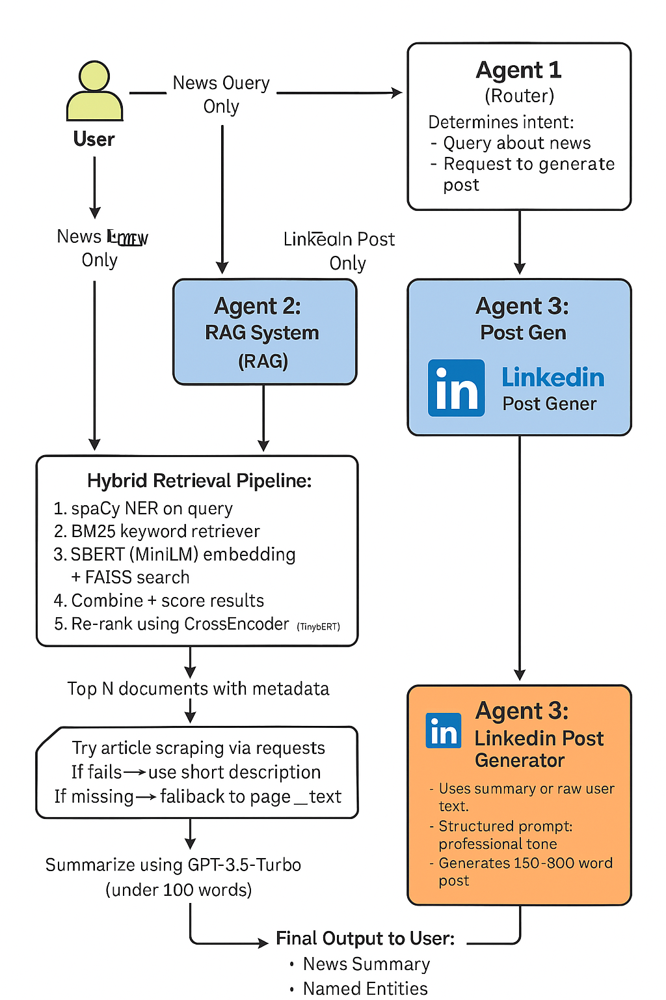
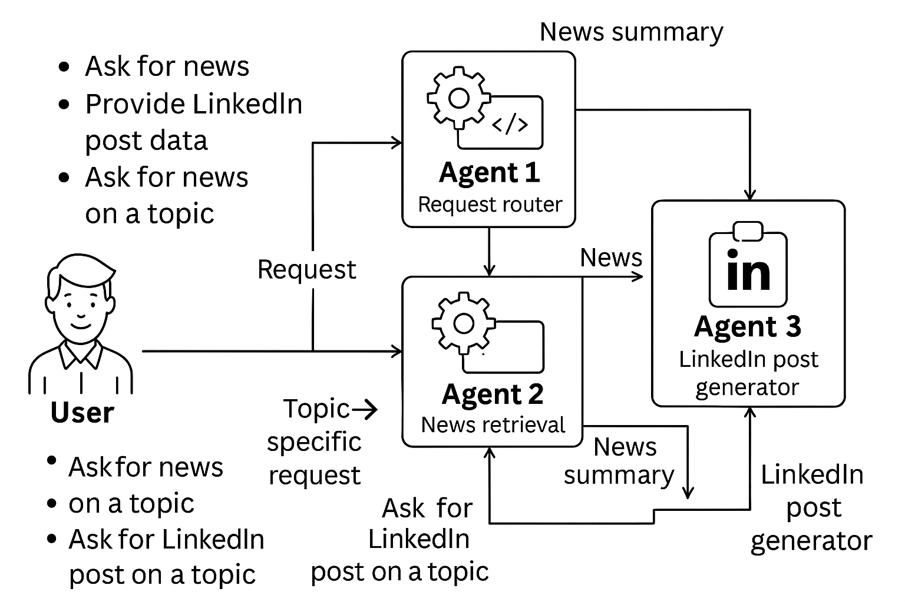

Absolutely! Here's your complete `README.md` content in standard Markdown format — ready to drop into your project:

---

```markdown
# 📰 News Article RAG System with LinkedIn Post Generator

A Retrieval-Augmented Generation (RAG) system designed to answer queries using news articles from the [Kaggle News Category Dataset](https://www.kaggle.com/datasets/rmisra/news-category-dataset), and generate professional LinkedIn posts based on user queries or article content.
```
---
## 🧠 Architecture Overview




## 🚀 Features

### ✅ Core Functionality
- Retrieval-Augmented Generation (RAG) using FAISS + BM25 hybrid search
- LLM-powered summarization with fallback logic (scraped article → short description → page content)
- Named Entity Recognition (NER) for boosting relevance and visual display
- LinkedIn post generator with professional tone

### 🧠 Smart Retrieval Stack
- Semantic search via Sentence-BERT (MiniLM)
- Keyword-based search via BM25
- CrossEncoder re-ranking (TinyBERT) for relevance precision
- Entity-based document boosting

### 🧰 Robust Design
- Modular agent-based routing system (Agent 1, Agent 2, Agent 3)
- Token trimming to prevent prompt overflows
- Cached article scraping to avoid repeat requests
- Summary capped at 100 words, LinkedIn post at 200 words

---

## 📁 Project Structure

```
project-root/
├── agents/
│   ├── agent_router.py            # Agent 1: request router
│   ├── rag_agent.py              # Agent 2: summarization engine
│   └── post_generator.py         # Agent 3: LinkedIn post writer
│
├── retrievers/
│   ├── hybrid_retriever.py       # FAISS + BM25 + rerank + NER boosting
│   ├── load_vector_store.py
│   └── build_vector_store.py
│
├── data/
│   ├── cleaned_news.csv
│   ├── cleaned_news_final.csv
│   └── data_preprocessing.py     # Normalize & structure text fields
│
├── utils/
│   └── ner_utils.py              # NER using spaCy
│
├── faiss_index/                  # Vector store index
├── main.py                       # CLI application
├── requirements.txt              # Dependency list
└── README.md                     # This file
```

---

## ⚙️ Installation & Setup

### ✅ 1. Clone the repository
```bash
git clone https://github.com/your-username/news-rag-system.git
cd news-rag-system
```

### ✅ 2. Create a virtual environment
```bash
python3 -m venv venv
source venv/bin/activate  # On Windows: venv\Scripts\activate
```

### ✅ 3. Install dependencies
```bash
pip install -r requirements.txt
python -m spacy download en_core_web_sm
```

### ✅ 4. Prepare the data
Ensure `News_Category_Dataset_v2.json` is available.
Run preprocessing:
```bash
python data/data_preprocessing.py
```

### ✅ 5. Build the FAISS vector index
```bash
python retrievers/build_vector_store.py
```

### ✅ 6. Run the app
```bash
python main.py
```

---

## 🧪 How to Use

### Option 1: Ask a news question (summary only)
- App routes to Agent 2
- Retrieves relevant articles
- Summarizes the top results under 100 words

### Option 2: Ask a news question and get LinkedIn post
- Agent 1 → Agent 2 (retrieve) → Agent 3 (generate post)

### Option 3: Provide your own text for post generation
- Routes directly to Agent 3

---

## 🧠 Behind the Scenes

### 🧩 Retrieval Pipeline
- Query → FAISS + BM25 → Score Merge → NER Boost → CrossEncoder Rerank → Top 2

### 📝 Summarization
- Scrapes full article (if possible)
- Falls back to short_description or content chunk
- Token count trimmed to 500 tokens

### 🧠 NER
- Used in retrieval (boosting) and post-summary entity display

### 💬 LinkedIn Post Generator
- Structured prompt
- Controlled tone (professional, no emojis/hashtags)
- Word limit applied (~200 words)

---

## 🔐 Environment Variables

Create a `.env` file:
```
OPENAI_API_KEY=your-openai-key
```

---

## 📚 Dependencies

```
transformers==4.37.2
sentence-transformers==2.6.1
torch>=1.13.1
accelerate==0.26.1
langchain
langchain-community
langchain-huggingface
langchain-openai
faiss-cpu
openai
pandas
spacy
requests
beautifulsoup4
tiktoken
```

---

## 💡 Potential Improvements

- Add persona/tone control in post generation
- Support multilingual LinkedIn output
- Enable real-time article fetching from RSS/news APIs
- Log NER entities + scores
- UI wrapper using Streamlit or Flask

---

## 📃 License

MIT License.

---

## 👨‍💻 Author

Built with ❤️ by [Your Name]. Contributions welcome!

---
```

---

✅ Let me know if you'd like a `GitHub-friendly` architecture diagram or a presentation deck next. You're just a polish away from a showcase-worthy submission! 🚀